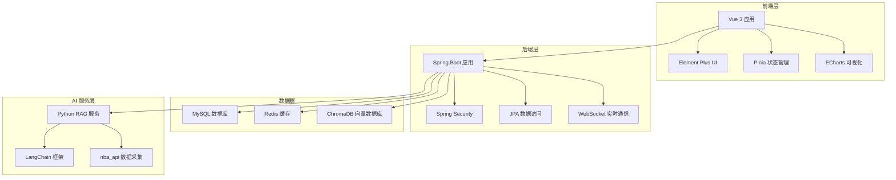

# NBAManager 项目概览报告

> 生成时间：2026-06-24
> 项目版本：v3.1
> 报告类型：全面均衡覆盖

## 目录

1. [项目概述](#1-项目概述)
2. [技术架构](#2-技术架构)
3. [功能模块详解](#3-功能模块详解)
4. [配置与部署](#4-配置与部署)
5. [代码质量分析](#5-代码质量分析)
6. [改进建议](#6-改进建议)

## 1. 项目概述

### 1.1 项目背景
NBAManager 是一个基于现代 Web 技术栈构建的 NBA 数据管理与分析平台。项目采用前后端分离架构，旨在为篮球爱好者、数据分析师和球队管理人员提供全面的 NBA 数据服务。

### 1.2 项目目标
- 提供全面的 NBA 数据查询和分析功能
- 实现智能化的数据检索和推荐系统
- 支持社区互动和用户生成内容
- 提供直观的数据可视化界面

### 1.3 主要功能
- **数据看板**：实时展示 NBA 比赛数据、球员统计和球队排名
- **球队管理**：球队信息管理、球员阵容分析
- **球员数据**：详细球员数据、投篮热图、职业生涯统计
- **赛事资讯**：比赛新闻、赛事预告、赛后分析
- **季后赛**：季后赛对阵、比赛预测、历史数据
- **历史数据**：历史比赛记录、球员职业生涯数据
- **社区互动**：用户发帖、评论、点赞功能
- **选秀数据库**：选秀历史、球员发展潜力分析
- **智能搜索**：基于 RAG 的智能问答和数据检索
- **用户系统**：用户注册、登录、个人资料管理
- **管理后台**：系统管理、用户管理、数据维护

### 1.4 项目发展历程
- **v1.0**：基础数据展示功能
- **v2.0**：添加社区互动和用户系统
- **v3.0**：集成 RAG 智能搜索功能
- **v3.1**：优化性能和用户体验

## 2. 技术架构

### 2.1 前端技术栈
- **框架**：Vue 3 (Composition API)
- **构建工具**：Vite
- **UI 组件库**：Element Plus
- **状态管理**：Pinia
- **可视化**：ECharts
- **类型系统**：TypeScript
- **HTTP 客户端**：Axios

### 2.2 后端技术栈
- **框架**：Spring Boot 3.2.5
- **安全框架**：Spring Security
- **数据访问**：Spring Data JPA
- **数据库**：MySQL 8.0
- **缓存**：Redis
- **实时通信**：WebSocket
- **构建工具**：Maven
- **Java 版本**：17

### 2.3 数据采集与 AI 服务
- **数据采集**：Python + nba_api
- **AI 框架**：LangChain
- **向量数据库**：ChromaDB
- **Web 框架**：FastAPI
- **模型服务**：本地部署的 AI 模型

### 2.4 系统架构图



### 2.5 数据流
1. 前端通过 REST API 或 WebSocket 与后端通信
2. 后端处理业务逻辑，访问数据库和缓存
3. AI 服务提供智能搜索和推荐功能
4. 数据采集服务定期更新 NBA 数据

## 3. 功能模块详解

### 3.1 数据看板模块
- **功能**：实时展示 NBA 比赛数据、球员统计和球队排名
- **技术实现**：Vue 3 组件 + ECharts 图表
- **数据源**：后端 REST API
- **关键组件**：`DashboardView.vue`

### 3.2 球队管理模块
- **功能**：球队信息管理、球员阵容分析
- **技术实现**：Vue 3 组件 + 表格展示
- **数据源**：后端 REST API
- **关键组件**：`TeamDetailView.vue`

### 3.3 球员数据模块
- **功能**：详细球员数据、投篮热图、职业生涯统计
- **技术实现**：Vue 3 组件 + ECharts 投篮热图
- **数据源**：后端 REST API + Python 数据采集
- **关键组件**：`PlayerDetailView.vue`, `ShotChart.vue`

### 3.4 赛事资讯模块
- **功能**：比赛新闻、赛事预告、赛后分析
- **技术实现**：Vue 3 组件 + 文章列表
- **数据源**：后端 REST API
- **关键组件**：`NewsView.vue`

### 3.5 季后赛模块
- **功能**：季后赛对阵、比赛预测、历史数据
- **技术实现**：Vue 3 组件 + 对阵图
- **数据源**：后端 REST API
- **关键组件**：`PlayoffView.vue`, `ConferenceBracket.vue`

### 3.6 历史数据模块
- **功能**：历史比赛记录、球员职业生涯数据
- **技术实现**：Vue 3 组件 + 数据表格
- **数据源**：后端 REST API
- **关键组件**：`HistoricalDataView.vue`

### 3.7 社区互动模块
- **功能**：用户发帖、评论、点赞功能
- **技术实现**：Vue 3 组件 + WebSocket 实时更新
- **数据源**：后端 REST API + WebSocket
- **关键组件**：`CommunityView.vue`, `PostDetailView.vue`

### 3.8 选秀数据库模块
- **功能**：选秀历史、球员发展潜力分析
- **技术实现**：Vue 3 组件 + 数据可视化
- **数据源**：后端 REST API
- **关键组件**：`DraftView.vue`

### 3.9 智能搜索（RAG）模块
- **功能**：基于 RAG 的智能问答和数据检索
- **技术实现**：Vue 3 组件 + Python RAG 服务
- **数据源**：Python RAG 服务 + 向量数据库
- **关键组件**：`SmartSearchView.vue`

### 3.10 用户系统模块
- **功能**：用户注册、登录、个人资料管理
- **技术实现**：Vue 3 组件 + Spring Security
- **数据源**：后端 REST API
- **关键组件**：`LoginView.vue`, `RegisterView.vue`, `ProfileView.vue`

### 3.11 管理后台模块
- **功能**：系统管理、用户管理、数据维护
- **技术实现**：Vue 3 组件 + 管理界面
- **数据源**：后端 REST API
- **关键组件**：`AdminView.vue`

### 3.12 其他辅助模块
- **通知系统**：实时通知和消息推送
- **主题系统**：深色/浅色主题切换
- **国际化**：多语言支持（计划中）

## 4. 配置与部署

### 4.1 开发环境配置
- **Java 环境**：JDK 17+
- **Node.js 环境**：v18+
- **Python 环境**：Python 3.10+
- **数据库**：MySQL 8.0+
- **缓存**：Redis 7.0+

### 4.2 后端配置
- **主配置文件**：`backend/src/main/resources/application.yml`
- **安全配置**：`SecurityConfig.java`
- **数据库配置**：MySQL 连接配置
- **Redis 配置**：缓存和会话配置

### 4.3 前端配置
- **构建配置**：`frontend/vite.config.ts`
- **环境变量**：`.env.development`, `.env.production`
- **API 代理**：开发环境 API 代理配置

### 4.4 Python 服务配置
- **依赖管理**：`requirements.txt`
- **模型配置**：AI 模型路径和参数
- **向量数据库**：ChromaDB 配置

### 4.5 部署流程
1. **后端部署**：
   ```bash
   cd backend
   mvn clean package
   java -jar target/nbamanager-*.jar
   ```

2. **前端部署**：
   ```bash
   cd frontend
   npm install
   npm run build
   # 将 dist/ 目录部署到 Web 服务器
   ```

3. **Python 服务部署**：
   ```bash
   cd backend/scripts
   pip install -r requirements.txt
   python rag_server.py
   ```

### 4.6 环境变量配置
- `DB_HOST`：数据库主机
- `DB_PORT`：数据库端口
- `DB_NAME`：数据库名称
- `DB_USERNAME`：数据库用户名
- `DB_PASSWORD`：数据库密码
- `REDIS_HOST`：Redis 主机
- `REDIS_PORT`：Redis 端口
- `JWT_SECRET`：JWT 密钥